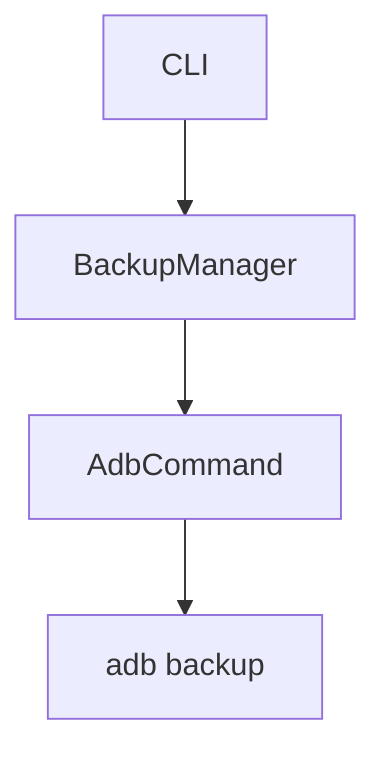

# Android Backup Tool - Agent Guidelines

This file provides guidance for agents working in this repository.

## Build Commands

```bash
# Build
cargo build                    # Debug build
cargo build --release          # Release build with optimizations

# Run
cargo run -- [args]            # Run with CLI args
cargo run -- -- help           # Show help

# Test
cargo test                     # Run all tests
cargo test <test_name>         # Run single test by name
cargo test -- --nocapture      # Run tests with output (println!)

# Lint & Format
cargo clippy --all-targets --all-features -- -D warnings  # Strict lint
cargo fmt                      # Format code
cargo fmt -- --check           # Check formatting without changes

# Check all
cargo check                    # Type check only
cargo check --all-features     # Type check with all features
```

## Project Structure

```text
src/
├── main.rs      # Entry point, CLI setup, command handlers
├── cli.rs       # Clap CLI argument definitions
├── adb.rs       # ADB command execution wrapper
├── backup.rs    # Backup operations and metadata
├── restore.rs   # Restore operations and validation
├── device.rs    # Device detection and management
├── crypto.rs    # Encryption utilities (backup)
└── error.rs     # Custom error types (thiserror)
```

## Code Style

### Rust Guidelines

Follow [`.agents/rules/rust.md`](.agents/rules/rust.md) for all Rust code:

**Naming Conventions:**

- Types/Traits: `PascalCase` (e.g., `BackupManager`, `DeviceState`)
- Functions/Methods/Variables: `snake_case` (e.g., `get_devices`, `backup_path`)
- Constants/Statics: `SCREAMING_SNAKE_CASE` (e.g., `MAX_RETRIES`)

**Imports:** Group by std → external crates → internal modules:

```rust
use std::path::PathBuf;
use std::process::Command;

use log::{debug, info};
use thiserror::Error;

use crate::error::{AppError, Result};
```

**Error Handling:**

- Use `thiserror` for library error types (see `src/error.rs`)
- Use `anyhow` for application-level errors
- Always propagate with `?` operator
- Never use `unwrap()` or `expect()` in production code

**Formatting:**

- 4 spaces indentation
- 100 character line limit
- Run `cargo fmt` before committing

### File Organization

1. Public items first (structs, enums, functions)
2. Private implementation
3. `#[cfg(test)]` module at bottom

### Testing Conventions

**Unit Tests:** In `#[cfg(test)]` modules within source files:

```rust
#[cfg(test)]
mod tests {
    use super::*;

    #[test]
    fn test_backup_creates_metadata_file() {
        // Test implementation
    }
}
```

**Test Naming:** `test_<feature>_<expected_behavior>`

**Integration Tests:** In `tests/` directory.

**Mocking:** Mock external dependencies (ADB binary, filesystem).

## Git Workflow

Follow [.agents/rules/git.md](.agents/rules/git.md):

- Conventional commits: `type: description`
- Types: `feat`, `fix`, `docs`, `chore`, `refactor`, `test`
- One logical change per commit
- Branch naming: `feat/`, `fix/`, `chore/`

## Project-Specific Guidelines

### ADB Integration

- Always check `adb devices` before operations
- Handle device authorization state explicitly (`DeviceState::Unauthorized`)
- Use serial numbers for multi-device support
- Parse output robustly - don't assume format

### ADB Output Parsing

The `adb devices -l` output format is:

```text
List of devices attached
serial state product:model:transport_id
```

Parse with `split_whitespace()`, skip first line (header).

### Backup Flow

1. Validate device is connected and authorized
2. Generate backup filename with timestamp
3. Execute `adb backup` command
4. Write metadata sidecar file (`.json`)
5. Verify backup file exists and has content

### Restore Flow

1. Validate backup file exists and is readable
2. Check backup format (size, header)
3. Execute `adb restore` command
4. Handle password if backup is encrypted

## Documentation

Use [mermaid diagrams](https://mermaid.js.org/) for architecture and flowcharts:



Follow [.agents/rules/markdown.md](.agents/rules/markdown.md) for markdown style.

## Dependencies

Core: clap, serde, anyhow, thiserror, chrono, dirs, log, aes-gcm, flate2, indicatif

## Known Constraints

- ADB binary must be installed on system
- Device must be authorized (USB debugging accepted)
- Android 4.0+ required for backup format
