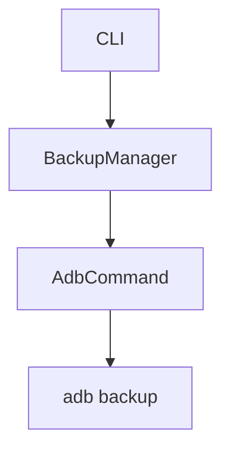

# Android Backup Tool - Agent Guidelines

This file provides guidance for agents working in this repository.

## Build Commands

```bash
cargo build                    # Build the project
cargo build --release          # Build with optimizations
cargo run -- [args]           # Run the application
cargo test <test_name>        # Run a single test
cargo test -- --nocapture     # Run tests with output
cargo clippy --all-targets --all-features -- -D warnings  # Lint
cargo fmt                     # Format code
```

## Project Structure

```
src/
├── main.rs      # Entry point, CLI setup, command handlers
├── cli.rs       # Clap CLI argument definitions
├── adb.rs       # ADB command execution wrapper
├── backup.rs    # Backup operations and metadata
├── restore.rs   # Restore operations and validation
├── device.rs    # Device detection and management
├── crypto.rs    # Encryption utilities (backup)
└── error.rs     # Custom error types (thiserror)
```

## Code Style Reference

See [.agents/rules/rust.md](.agents/rules/rust.md) for Rust guidelines:
- Safety, strictness, modern idioms
- Naming conventions, error handling, best practices

See [.agents/rules/git.md](.agents/rules/git.md) for Git workflow:
- Atomic commits, conventional commits format, branch naming

See [.agents/rules/github.md](.agents/rules/github.md) for GitHub PR/issue workflow.

See [.agents/rules/markdown.md](.agents/rules/markdown.md) for Markdown style.

Use **mermaid diagrams** for architecture, flowcharts, and sequence diagrams:



See [.agents/guides/documentation.md](.agents/guides/documentation.md) for API docs examples.

## Project-Specific Guidelines

### ADB Integration
- Always check `adb devices` before operations
- Handle device authorization state explicitly
- Use serial numbers for multi-device support
- Parse output robustly - don't assume format

### Testing
- Unit tests in `#[cfg(test)]` modules within source files
- Integration tests in `tests/` directory
- Use descriptive test names: `test_backup_creates_metadata_file`
- Mock external dependencies (ADB binary calls)
