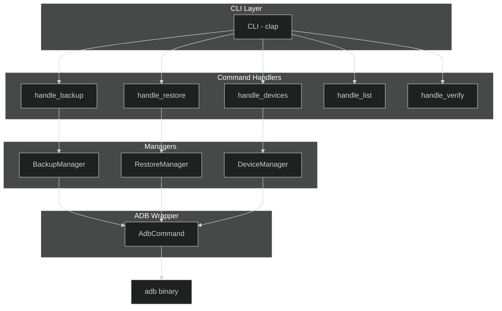
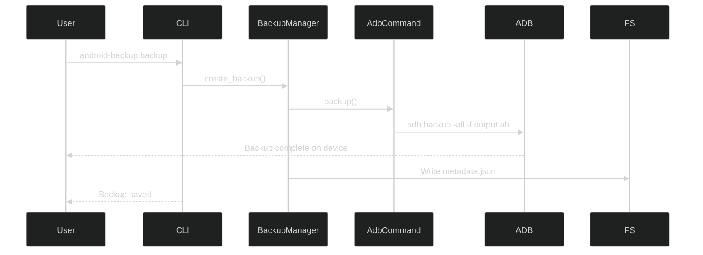
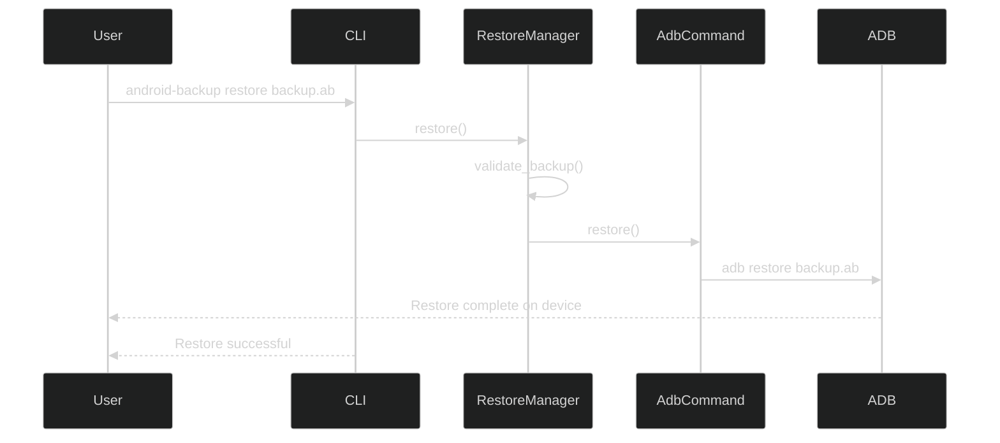
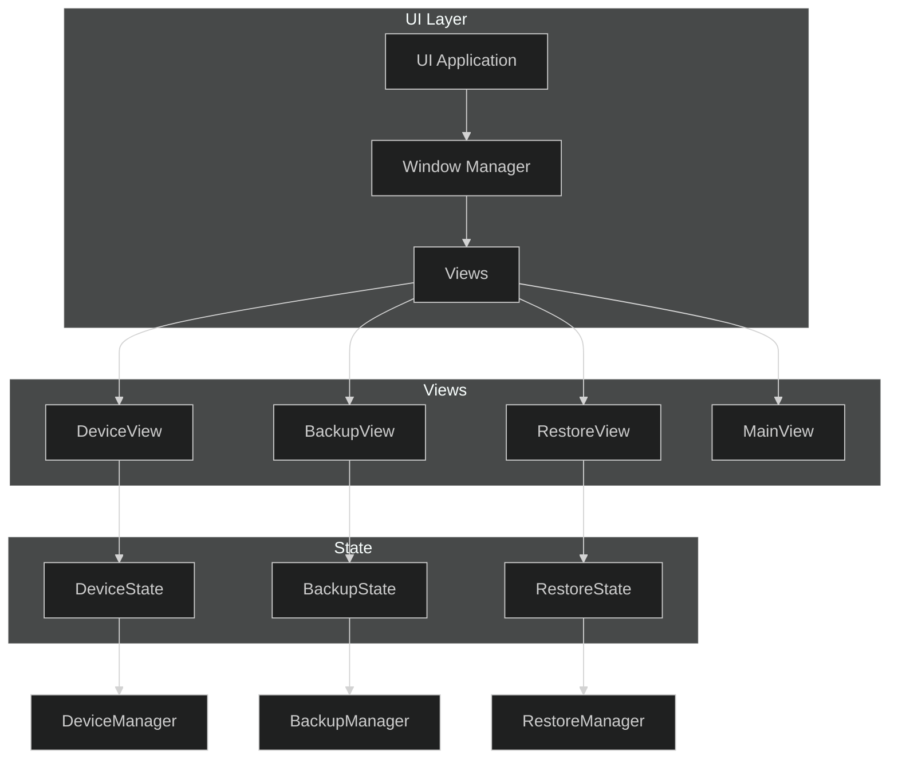

# Android Backup Tool - Design

## Overview

A Rust CLI tool to backup/restore Android devices via ADB. Targets Linux, macOS, Windows.

## Architecture



## Modules

### `adb.rs` - ADB Wrapper

Wraps `adb` binary execution via `std::process::Command`.

```rust
pub struct AdbCommand {
    path: PathBuf,
    serial: Option<String>,
}

impl AdbCommand {
    pub fn new() -> Result<Self>
    pub fn with_path(path: PathBuf) -> Self
    pub fn with_serial(self, serial: String) -> Self
    pub fn get_devices() -> Result<Vec<AdbDevice>>
    pub fn backup(&self, output: &str, options: &BackupOptions) -> Result<()>
    pub fn restore(&self, backup: &str, password: Option<&str>) -> Result<()>
}
```

### `backup.rs` - Backup Manager

Manages backup creation, listing, and verification.

```rust
pub struct BackupManager { adb: AdbCommand }

impl BackupManager {
    pub fn new() -> Result<Self>
    pub fn with_serial(serial: String) -> Result<Self>
    pub fn create_backup(&self, output: &str, options: &BackupOptions) -> Result<BackupMetadata>
    pub fn list_backups(directory: &str) -> Result<Vec<BackupInfo>>
}

pub struct BackupMetadata {
    pub version: u32,
    pub created_at: DateTime<Utc>,
    pub backup_type: String,
    pub encrypted: bool,
    pub compressed: bool,
    pub size_bytes: u64,
}
```

### `restore.rs` - Restore Manager

Manages restore operations and backup validation.

```rust
pub struct RestoreManager { adb: AdbCommand }

impl RestoreManager {
    pub fn new() -> Result<Self>
    pub fn with_serial(serial: String) -> Result<Self>
    pub fn restore(&self, backup: &str, password: Option<&str>) -> Result<()>
    pub fn validate_backup(&self, backup: &str) -> Result<BackupValidation>
}
```

### `device.rs` - Device Manager

Handles device detection and information.

```rust
pub struct DeviceManager { adb: AdbCommand }

impl DeviceManager {
    pub fn new() -> Result<Self>
    pub fn list_devices() -> Result<Vec<AdbDevice>>
    pub fn find_device(serial: Option<&str>) -> Result<AdbDevice>
}

pub struct AdbDevice {
    pub serial: String,
    pub state: DeviceState,
    pub model: Option<String>,
    pub product: Option<String>,
}
```

### `crypto.rs` - Encryption

AES-256-GCM encryption for backups. Currently scaffolding.

### `cli.rs` - CLI Definition

Clap derive-based CLI with subcommands.

### `error.rs` - Error Types

Custom error enum using thiserror.

## CLI Interface

```text
android-backup [OPTIONS] <COMMAND>

Commands:
  backup      Create a backup
  restore     Restore from backup
  devices     List connected devices
  list        List backups in directory
  verify      Verify backup file
  install-adb Install ADB

Options:
  -v, --verbose        Enable verbose output
  -a, --adb-path PATH  ADB binary path
  -s, --serial SERIAL  Device serial number
```

## Data Flow

### Backup Flow



### Restore Flow



## Blinc UI Integration

The tool includes a graphical UI built with [Blinc](https://github.com/project-blinc/Blinc), a Rust-native UI framework with GPU-accelerated rendering, reactive signals, and CSS-based styling.

### UI Architecture



### Window Structure

| Window | Purpose |
|--------|---------|
| Main Window | Entry point with navigation menu |
| Device Selector | Choose target device for operations |
| Backup View | Select apps, configure options, initiate backup |
| Restore View | Browse backups, select restore target |
| Progress View | Real-time progress for ongoing operations |

### State Management

Blinc's reactive signals handle UI state:

```rust
// Device selection state
let selected_device = ctx.use_state_keyed("selected_device", || None::<String>);

// Backup progress state
let backup_progress = ctx.use_state_keyed("backup_progress", || 0.0_f64);

// Current view navigation
let current_view = ctx.use_state_keyed("current_view", || View::Main);
```

### Dependencies (UI)

| Crate | Purpose |
|-------|---------|
| blinc_app | Window management, event handling |
| blinc_layout | Flexbox layout system |
| blinc_animation | Spring animations, transitions |
| blinc_core | Core components, signals |

### CSS Styling

Blinc supports CSS for theming:

```css
:root {
    --bg-primary: #0f172a;
    --bg-secondary: #1e293b;
    --text-primary: #f8fafc;
    --accent: #3b82f6;
}

.window {
    background: var(--bg-primary);
    border-radius: 16px;
}

.btn-primary {
    background: var(--accent);
    border-radius: 8px;
    padding: 12px 24px;
}
```

### Build Configuration

```toml
[dependencies]
blinc_app = { git = "https://github.com/project-blinc/Blinc" }
blinc_layout = { git = "https://github.com/project-blinc/Blinc" }
blinc_animation = { git = "https://github.com/project-blinc/Blinc" }
blinc_core = { git = "https://github.com/project-blinc/Blinc" }
```

### Running the UI

```bash
cargo run -- ui    # Launch graphical UI mode
cargo run -- cli   # Launch CLI mode (default)
```

## Dependencies

### Core

| Crate           | Purpose             |
| :-------------- | :----------------- |
| clap            | CLI parsing        |
| serde           | Serialization      |
| anyhow          | Error handling     |
| thiserror       | Error enums        |
| chrono          | Date/time          |
| dirs            | Platform dirs      |
| log/env_logger  | Logging            |
| aes-gcm         | Encryption         |
| flate2          | Compression        |
| indicatif       | Progress bars      |

### Blinc UI

| Crate           | Purpose             |
| :-------------- | :----------------- |
| blinc_app       | Window management  |
| blinc_layout    | Flexbox layout     |
| blinc_animation | Spring animations  |
| blinc_core      | Core components    |

## File Format

Backups use Android Backup format (`.ab`):

- `adb backup -all` creates tar/gzip stream
- Optional AES-256 encryption
- Metadata stored in separate `_metadata.json` sidecar file
