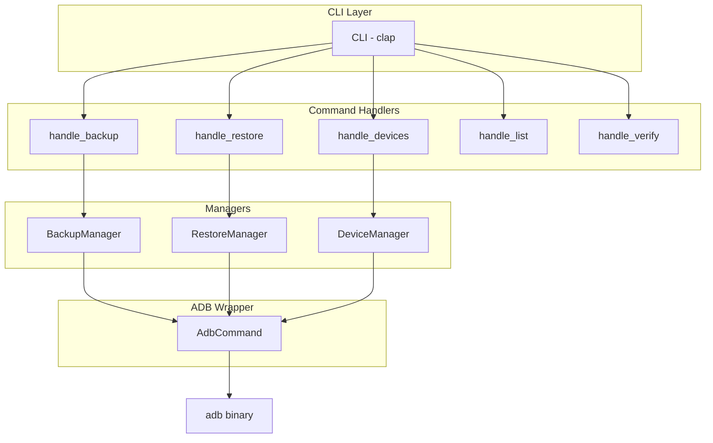
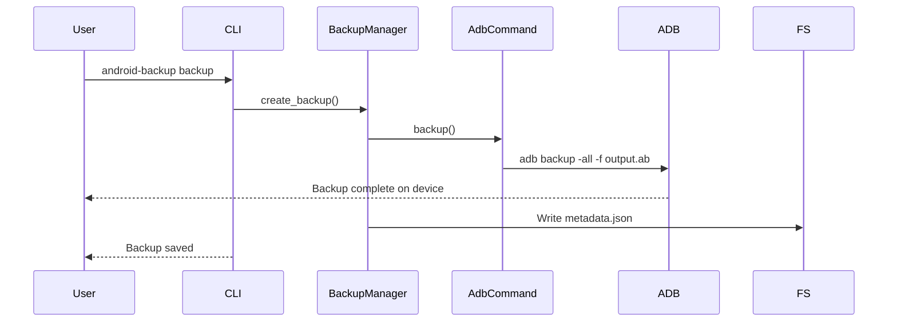
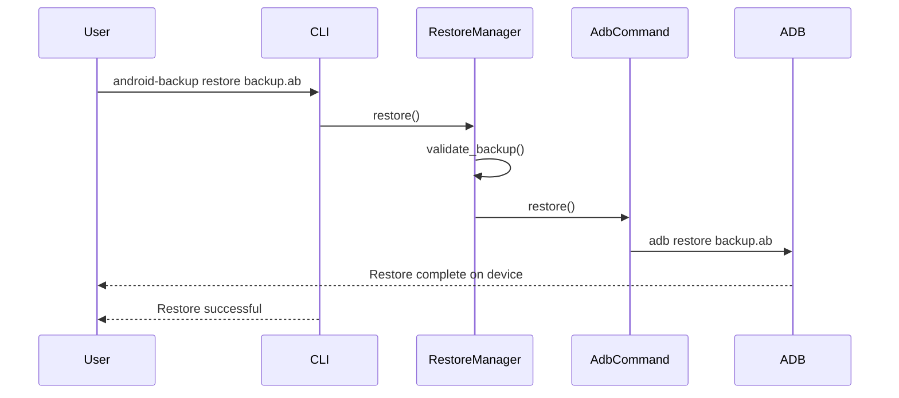

# Android Backup Tool - Design

## Overview

A CLI tool written in Rust to perform full Android device backups and restores using ADB (Android Debug Bridge). Targets desktop environments (Linux, macOS, Windows).

## Architecture



## Modules

### `adb.rs` - ADB Wrapper

Wraps `adb` binary execution via `std::process::Command`.

```rust
pub struct AdbCommand {
    path: PathBuf,
    serial: Option<String>,
}

impl AdbCommand {
    pub fn new() -> Result<Self>
    pub fn with_path(path: PathBuf) -> Self
    pub fn with_serial(self, serial: String) -> Self
    pub fn get_devices() -> Result<Vec<AdbDevice>>
    pub fn backup(&self, output: &str, options: &BackupOptions) -> Result<()>
    pub fn restore(&self, backup: &str, password: Option<&str>) -> Result<()>
}
```

### `backup.rs` - Backup Manager

Manages backup creation, listing, and verification.

```rust
pub struct BackupManager { adb: AdbCommand }

impl BackupManager {
    pub fn new() -> Result<Self>
    pub fn with_serial(serial: String) -> Result<Self>
    pub fn create_backup(&self, output: &str, options: &BackupOptions) -> Result<BackupMetadata>
    pub fn list_backups(directory: &str) -> Result<Vec<BackupInfo>>
}

pub struct BackupMetadata {
    pub version: u32,
    pub created_at: DateTime<Utc>,
    pub backup_type: String,
    pub encrypted: bool,
    pub compressed: bool,
    pub size_bytes: u64,
}
```

### `restore.rs` - Restore Manager

Manages restore operations and backup validation.

```rust
pub struct RestoreManager { adb: AdbCommand }

impl RestoreManager {
    pub fn new() -> Result<Self>
    pub fn with_serial(serial: String) -> Result<Self>
    pub fn restore(&self, backup: &str, password: Option<&str>) -> Result<()>
    pub fn validate_backup(&self, backup: &str) -> Result<BackupValidation>
}
```

### `device.rs` - Device Manager

Handles device detection and information.

```rust
pub struct DeviceManager { adb: AdbCommand }

impl DeviceManager {
    pub fn new() -> Result<Self>
    pub fn list_devices() -> Result<Vec<AdbDevice>>
    pub fn find_device(serial: Option<&str>) -> Result<AdbDevice>
}

pub struct AdbDevice {
    pub serial: String,
    pub state: DeviceState,
    pub model: Option<String>,
    pub product: Option<String>,
}
```

### `crypto.rs` - Encryption

AES-256-GCM encryption for backups. Currently scaffolding.

### `cli.rs` - CLI Definition

Clap derive-based CLI with subcommands.

### `error.rs` - Error Types

Custom error enum using thiserror.

## CLI Interface

```text
android-backup [OPTIONS] <COMMAND>

Commands:
  backup      Create a backup
  restore     Restore from backup
  devices     List connected devices
  list        List backups in directory
  verify      Verify backup file
  install-adb Install ADB

Options:
  -v, --verbose        Enable verbose output
  -a, --adb-path PATH  ADB binary path
  -s, --serial SERIAL  Device serial number
```

## Data Flow

### Backup Flow



### Restore Flow



## Future: Blinc UI Integration

The plan includes adding a Blinc-based TUI for:

- Interactive device selector
- Backup progress view
- Backup browser
- Main menu navigation

## Dependencies

| Crate           | Purpose             |
| :-------------- | :----------------- |
| clap            | CLI parsing        |
| serde           | Serialization      |
| anyhow          | Error handling     |
| thiserror       | Error enums        |
| chrono          | Date/time          |
| dirs            | Platform dirs      |
| log/env_logger  | Logging            |
| aes-gcm         | Encryption         |
| flate2          | Compression        |
| indicatif        | Progress bars      |

## File Format

Backups use Android Backup format (`.ab`):

- `adb backup -all` creates tar/gzip stream
- Optional AES-256 encryption
- Metadata stored in separate `_metadata.json` sidecar file
